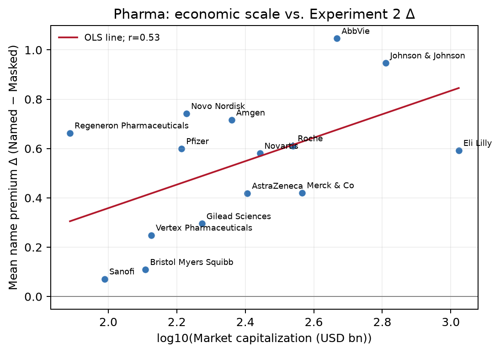
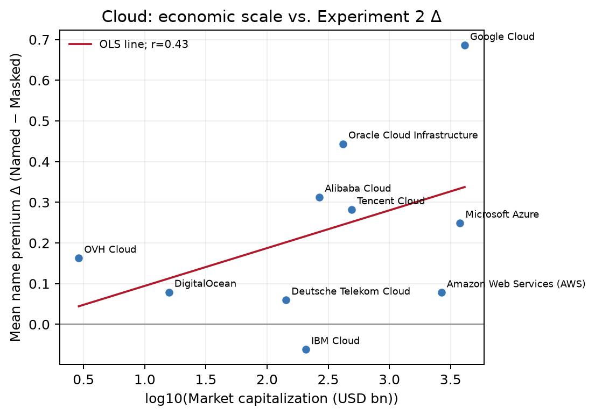
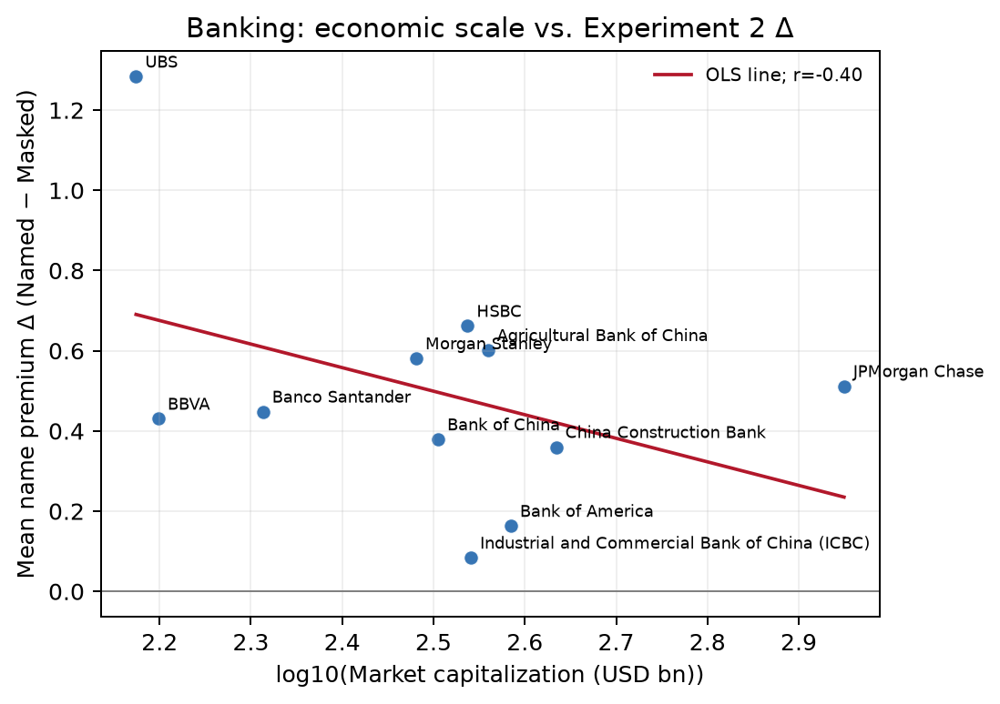
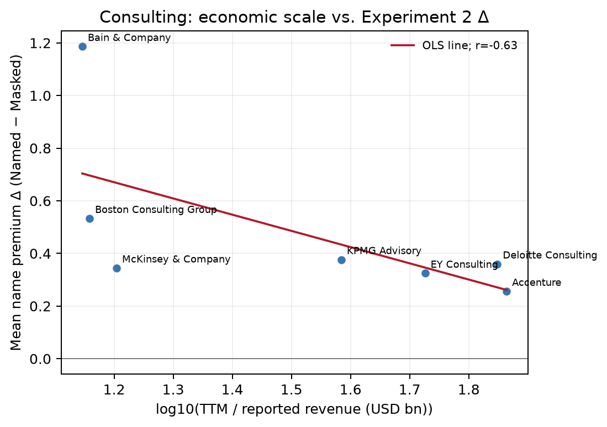

# Economic-scale analysis of Experiment 2

## Bottom line

Economic scale is not a single cross-sector explanation for the name premium. With the expanded public snapshot, log market cap is positive in pharma (r=0.53, permutation p=.045), negative in banking (r=-0.40, p=.211), and weak in cloud (r=0.22, p=.567). Consulting revenue is negatively associated (r=-0.63, p=.023) but comes from only seven private-network observations with mixed fiscal years. Treat all associations as exploratory, not causal.

## Data and estimand

- Outcome: company-level `mean_delta = Named - Masked`, averaged over the May-core model rows in `company_effects.csv`.
- The supplied `ranking_summary_postgres.csv` has 50 model-sector aggregates and no company identifier; it is used below as a ranking-stability check, not as the economic regression target.
- Public economic variables are parent-company market capitalization and TTM revenue (USD billions), collected from CompaniesMarketCap and saved in `public_economic_data.csv` with source URLs and retrieval dates. Parent values are proxies for branded subsidiaries (for example, AWS uses Amazon).
- For private consulting networks, publicly reported global-network revenue is included as a revenue-only observation; no market cap is imputed.
- We use log10(capitalization) and log10(revenue), Pearson/Spearman correlations, 50,000-label permutation p-values, and an exploratory two-variable OLS model.

## Correlations by sector

`n` is shown as market-cap observations / revenue observations. The two-variable model uses only companies with both variables.

| Sector | n (cap/revenue) | log market cap: r / rho / p | log revenue: r / rho / p | OLS R² (cap + revenue) |
|---|---:|---:|---:|---:|
| pharma | 15/15 | 0.53 / 0.45 / 0.045 | 0.31 / 0.34 / 0.268 | 0.28 |
| cloud | 10/10 | 0.43 / 0.50 / 0.210 | 0.31 / 0.26 / 0.380 | 0.25 |
| consulting | 1/7 | not estimable | -0.63 / -0.82 / 0.023 | not estimable |
| banking | 11/11 | -0.40 / -0.37 / 0.211 | -0.51 / -0.49 / 0.100 | 0.31 |

## Plots

The figures below show the company-level May-core Δ values against log economic scale. Red lines are within-sector OLS fits; labels identify companies.









Generate them with `MPLBACKEND=Agg python3 plot_economic_drivers.py`.

## What the data do and do not support

- **Pharma:** larger market cap is directionally associated with larger deltas; after adding Johnson & Johnson, the exploratory permutation result is p≈.045, but this is sensitive to the small sample and current market-cap snapshot. Eli Lilly remains a useful counterexample (largest cap, not the largest delta).
- **Cloud:** both economic indicators are weak; IBM Cloud is negative despite a large parent, while Oracle Cloud is high with a much smaller parent than Microsoft/Amazon. This argues against a simple scale-only account.
- **Banking:** the association is negative: the largest-cap banks tend to have smaller name lifts. This is the opposite of a generic 'bigger company gets more premium' story and may reflect profile, geography, or corpus-representation effects.
- **Consulting:** revenue coverage now includes several private networks, but market-cap analysis remains impossible because these firms are not separately quoted. The revenue-only result should be read as descriptive because the sample is small and sources report different fiscal years.
- **Google Cloud:** no reliable standalone parent-company page was found in the queried public market-cap source; it remains missing rather than being imputed.

## Ranking-stability check from the supplied CSV

| Sector (May core) | Mean absolute rank change | Pair reversals (%) | Top-3 Jaccard | Spearman ρ |
|---|---:|---:|---:|---:|
| pharma | 1.78 | 14.57 | 0.45 | 0.85 |
| cloud | 0.41 | 3.41 | 0.81 | 0.97 |
| consulting | 0.72 | 8.39 | 0.73 | 0.93 |
| banking | 0.95 | 10.59 | 0.75 | 0.90 |

## Reproduce

```bash
cd /Users/gerardpc/repositories/aily/aily-bias-in-llms/experiments/correlation/drivers
python3 collect_public_economic_data.py
python3 economic_scale_analysis.py
```

The collector refreshes the public snapshot; because market caps and TTM revenue change over time, rerunning it can change the numerical correlations. Missing/private companies remain missing rather than being imputed.
